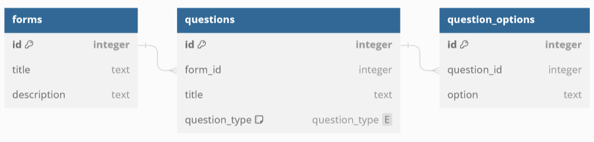

# CHAOS Technical Task

***Complete as many questions as you can.***

## Question 1
You have been given a skeleton function `process_data` in the `data.rs` file.
Complete the parameters and body of the function so that given a JSON request of the form

```json
{
  "data": ["Hello", 1, 5, "World", "!"]
}
```

the handler returns the following JSON:
```json
{
  "string_len": 11,
  "int_sum": 6
}
```

Edit the `DataResponse` and `DataRequest` structs as you need.

## Question 2

### a)
Write (Postgres) SQL `CREATE TABLE` statements to create the following schema.
Make sure to include foreign keys for the relationships that will `CASCADE` upon deletion.


**Answer box:**
```sql
CREATE TABLE forms (
    --     Add columns here
);

CREATE TABLE questions (
    --     Add columns here
);

CREATE TABLE question_options (
    --     Add columns here
);
```

### b)
Using the above schema, write a (Postgres) SQL `SELECT` query to return all questions in the following format, given the form id `26583`:
```
   id    |   form_id   |           title             |   question_type   |     options
------------------------------------------------------------------------------------------------------------
 2       | 26583       | What is your full name?     | ShortAnswer       | [null]
 3       | 26583       | What languages do you know? | MultiSelect       | {"Rust", "JavaScript", "Python"}
 7       | 26583       | What year are you in?       | MultiChoice       | {"1", "2", "3", "4", "5+"}
```

**Answer box:**
```sql
-- Write query here
```